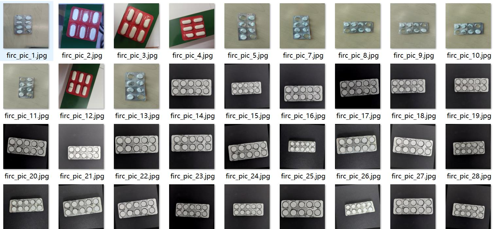
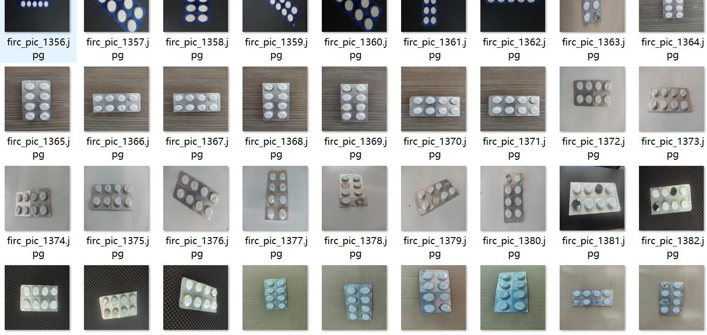
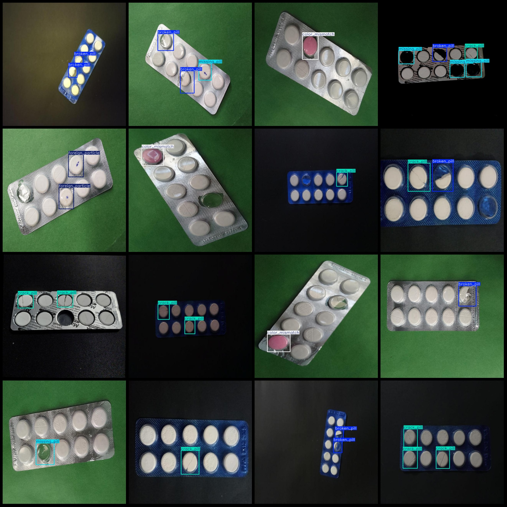
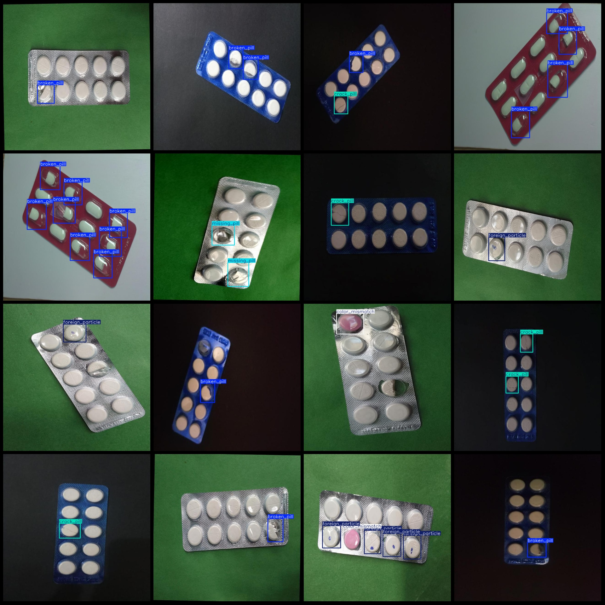

# Medical Drug Detection Dataset with Crackless Cracks in VOC+YOLO format, 1725 images, 5 categories

Dataset format: Pascal VOC format + YOLO format (without split paths, only txt files containing JPG images and corresponding VOC format xml files and yolo format txt files)
Number of images (JPG file count): 1725
Number of annotations (xml file count): 1725
Number of annotations (txt file count): 1725
Number of annotation categories: 5
Annotation category names (note that the order in the yolo format is not consistent with this, but follows the order in the labels folder classes.txt): ["broken_pill", "color_mismatch", "crack_pill", "foreign_particle", "missing_pill"]
Number of boxes per category:
broken_pill (pill damage) = 1726
color_mismatch (color mismatch) = 361
crack_pill (pill crack) = 1044
foreign_particle (foreign particle) = 280
missing_pill (pill missing) = 343
Total boxes: 3754
Number of images per category:
broken_pill (pill damage) = 788
color_mismatch(360)
crack_pill(620)
foreign_particle(225)
missing_pill(151)
image resolution: 640x640  
Use annotation tool: labelImg
Annotation rules: draw a rectangle around the class
Important notes: dataset does not have separate training, validation, and test sets; you will need to divide them yourself.
Special statement: This dataset does not guarantee any accuracy for the trained model or weight file.
Image preview:
## Images

Here is a pay link on Stripe ( https://buy.stripe.com/3cs8yP7sY87d0vu9AB ). Please contact me lonlonago@foxmail.com after funding $89, and I will send you a complete data files , thank you!

